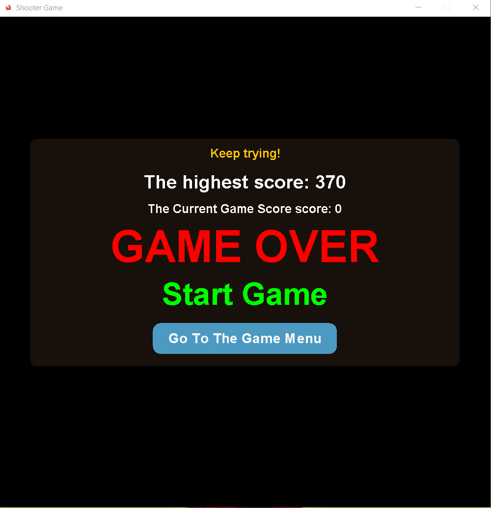

Shooter Game 2D - using Swing and 2D Graphic Elements

###  Description 

This simple shooter game is a basic Java application that demonstrates the use of Java 2D graphics. In this game, the
player controls a square that can move left and right at the bottom of the window. The player can shoot projectiles
upwards to destroy incoming enemies from the top of the screen. The game ends if an enemy collides with the player.

### How to Run

To run the game, you need to have Java installed on your system. Follow these steps:

1. Clone the repository or download the source code.
2. Navigate to the directory containing the SimpleShooterGame.java file.
3. Compile the Java file using the command: javac SimpleShooterGame.java
4. Run the compiled class with the command: java SimpleShooterGame

Make sure you're in the correct directory and have the necessary permissions to execute these commands.

### How to Play

* Use the **left** and **right** arrow keys to move the player left and right.
* Press the **spacebar** to shoot projectiles.
* Press the **R** keys to restart the game.
* Avoid letting enemies reach the player. Each enemy destroyed increases your score.
* The game ends when an enemy collides with the player, displaying a "GAME OVER" message.

### Features

* **Player Movement:** The player can move left and right across the bottom of the
  screen.
* **Shooting:** The player can shoot projectiles to destroy enemies.
* **Enemies:**  Enemies appear from the top of the screen at regular intervals and move
  downwards.
* **Collision Detection:**  The game detects collisions between projectiles and enemies,
  as well as between enemies and the player.
* **Scoring:**  The player earns points for each enemy destroyed.
* **Game Over State:**  The game ends when an enemy collides with the player, displaying
  a "GAME OVER" message.
* **Levels Menu:**  The game has two types of level, hard level and normal level. Hard
  level increasing the difficulty of game.
* **High-score system:**   Added a high-score system to track the best performances.

### Future Enhancements

* Introducing different types of enemies with unique behaviors.
* Implementing power-ups for the player (e.g., faster shooting, multi-directional shooting).

### Technical Details

**Language:** Java

**Graphics:** Java 2D API - Swing Graphical User Interface

**IDE:** IntelliJ IDEA.

### Author

Feel free to fork the project, submit pull requests, or suggest improvements via issues.